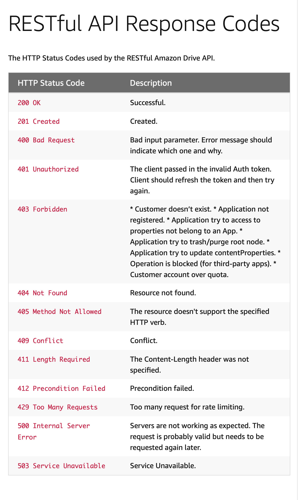

# Summary 10/02/2021

**Attendees:** _Steffen Holanger, Emil Elton, Sander Hurlen, Christoffer Træen_

1. We want to implement linting

2. We agreed upon this folder structure with (3.) `I` prefix for interfaces. 
   
   models/
   | decorators/ - *all generic decorators*
   | Election/
   | | constraints - *decorators/constraints for ElectionEntity*
   | | ElectionEntity.ts
   | | Electionrepository.ts
   | | ElectionStatus.ts
   | | ElectionState.ts
   | | ElectionStatus.ts
| | IElection.ts - *interfaces prefixes with I, to make it explicit*
   
   
   
3. Which HTTP codes to send as response:

| REQ     | SUCCESS |
| ------- | ------- |
| GET/    | 200     |
| PUT/    | 200     |
| POST/   | 201     |
| DELETE/ | 200     |

**This is the guide we will follow, and mostly use. With mozilla MDN HTTP status code dictionary as fallback**

5. Returning objects on crud operations

   | REQ     | NONE              | SUCCESS             |
   | ------- | ----------------- | ------------------- |
   | GET/    | [] - emtpy array  | [{}, ...]           |
   | GET/:id | {} - empty object | {key: value, ...}   |
   | PUT/:id |                   | {} - updated object |
   | POST/   | {}                | {} - created object |
   | DELETE/ | <empty>           | <empty>             |

We also discussed possible things to remove from the returning array/object. With the most important thing to remove is password.

Things to remove:

-   password
-   emails(?) - maybe encrypt/decrypt instead with somthing uniwue for the organizer (createdAt combined with other values)?

>  class-transformer: possible package for this

